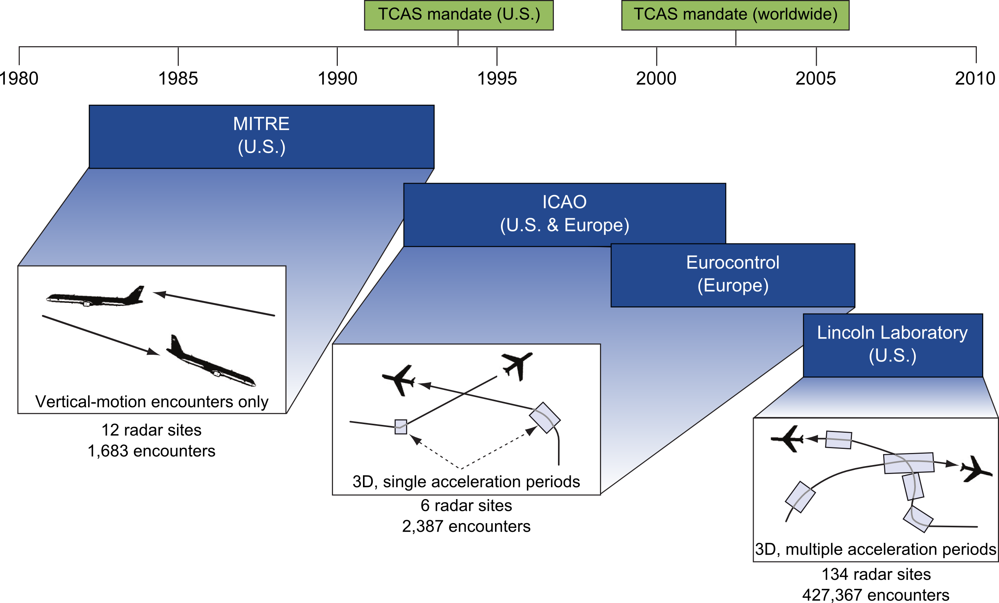

# Airspace Encounter Models Overview

For many aviation safety studies, aircraft behavior is represented using encounter models, which are statistical models of how aircraft behave during close encounters. They are used to provide a realistic representation of the range of encounter flight dynamics where an aircraft collision avoidance system would be likely to alert. Encounter models represent the encounter geometry, but also the aircraft behavior (accelerations) during the course of the encounter. Encounter models have been developed for many different manned operational contexts, but there are new considerations for unmanned aircraft operations including the lower operating altitudes and interactions with service providers and other users.

This GitHub organization and associated repositories are intended to eventually supersede the legacy [MIT Lincoln Laboratory hosted encounter model website](https://topa.atc.ll.mit.edu/lldata/) and align encounter model development with modern community driven software practices. As of 2019, this original MIT Lincoln Laboratory-hosted website has not been deprecated by this GitHub organization yet. Not all encounter model content is available on GitHub.

- [Airspace Encounter Models Overview](#airspace-encounter-models-overview)
	- [Point of Contact](#point-of-contact)
	- [Nomenclature](#nomenclature)
	- [Sponsors](#sponsors)
		- [UAS ExCom Science and Research Panel](#uas-excom-science-and-research-panel)
	- [Encounter Model Requirements](#encounter-model-requirements)
	- [Documentation](#documentation)
		- [Introductory](#introductory)
		- [Manned Correlated Model](#manned-correlated-model)
		- [Manned Due Regard](#manned-due-regard)
		- [Manned Helicopter Air Ambulance Model](#manned-helicopter-air-ambulance-model)
		- [Manned Littoral Model](#manned-littoral-model)
		- [Manned Uncorrelated Model](#manned-uncorrelated-model)
		- [Manned Unconventional Model](#manned-unconventional-model)
		- [Unmanned Uncorrelated Model](#unmanned-uncorrelated-model)
		- [Unmanned Recreational Model](
		#unmanned-recreational-model)
		- [Urban Air Mobility Uncorrelated Model](
		#urban-air-mobility-uncorrelated-model)
	- [Encounter Categories](#encounter-categories)
		- [Manned vs Manned](#manned-vs-manned)
		- [Unmanned vs Manned](#unmanned-vs-manned)
		- [Unmanned vs Unmanned](#unmanned-vs-unmanned)
	- [Download](#download)
		- [Terminology](#terminology)
		- [Trajectories](#trajectories)
		- [Encounter Sets](#encounter-sets)
	- [Select Applications and Use Cases](#select-applications-and-use-cases)
		- [Historical Perspective](#historical-perspective)
		- [Well Clear for UAS](#well-clear-for-uas)
		- [Evaluation of TCAS II Version 7.1](#evaluation-of-tcas-ii-version-71)
	- [Distribution Statement](#distribution-statement)

## Point of Contact

We encourage the use of the [GitHub Issues](https://guides.github.com/features/issues/) but when email is required, please contact the administrators at [encounter-model-ml-admin@mit.edu](mailto:encounter-model-ml-admin@mit.edu). As the encounter models transition to a more community driven effort, a separate mailing list for code discussion may be created.

## Nomenclature

Acronym | Phrase
 :--- | :---
ADS-B | [automatic dependent surveillance – broadcast](https://en.wikipedia.org/wiki/Automatic_dependent_surveillance_%E2%80%93_broadcast)
ATC | [air traffic control](https://en.wikipedia.org/wiki/Air_traffic_control)
DAA | detect and avoid
IFR | [instrument flight rules](https://en.wikipedia.org/wiki/Instrument_flight_rules)
SARP | science and research panel
sUAS | small unmanned aerial system
TCAS | [traffic collision avoidance system](https://en.wikipedia.org/wiki/Traffic_collision_avoidance_system)
UAS  | [unmanned aerial system](https://en.wikipedia.org/wiki/Unmanned_aerial_vehicle)
UAM | urban air mobility
UTM  | [UAS traffic management](https://en.wikipedia.org/wiki/Unmanned_aircraft_system_traffic_management)
VFR | [visual flight rules](https://en.wikipedia.org/wiki/Visual_flight_rules)

## Sponsors

Development has been funded by a variety of sponsors, primarily U.S. federal agencies, to support many different aviation safety efforts. This section is reserved for overviews of key funding agencies and the development they supported. It is the sponsor's discretion to provide content for this section.

### UAS ExCom Science and Research Panel

Since 2015, encounter model development has been funded by the UAS Executive Committee (ExCom) SARP, an organization chartered under the ExCom Senior Steering Group (SSG). The SARP consists of senior managers in eight U.S. Government federal agencies – DoD, FAA, NASA, DHS, DOI, DOC, DOJ, and DOE. It was founded in 2011 by the Office of the Under Secretary of Defense for Acquisition, Technology, and Logistics for Unmanned Warfare; in 2013, it was realigned and expanded under the UAS ExCom SSG. The SARP is led by a U.S. Government senior research advisor from the FAA and two co-chairs appointed by the SSG.

The SARP’s process involves collaboratively identifying key research needs, gaps, and overlaps through maintenance of a prioritized “gap” list. The SARP has four primary goals:

- To focus the scientific and technical capabilities of a broad Federal technical community upon key UAS integration science and research initiatives,
- To provide insight as to how these initiatives may align with commercial and academic science and research efforts to avoid duplication and reduce cost,
- To identify and validate (through the ExCom) known research gaps that impact the airspace integration of UAS and to review available published studies, and
- To coordinate and lead interagency resources and expertise to develop specific solutions and/or recommendations that address the ExCom’s highest-priority research gaps for UAS airspace integration.

As of 2015, the SARP addressed primary gaps of sUAS versus manned aircraft well clear, UAS risk to people on the ground, and barriers to multiple UAS operations. To support the SARP recommendations to the ExCom SSG, encounter models of unmanned aircraft behavior and low altitude airspace were required and developed.

## Encounter Model Requirements

With the exception of the [uncorrelated UAS model](#unmanned-uncorrelated-model), each encounter model of manned aircraft is a Bayesian Network, a representation of a multivariate probability distribution as a directed acyclic graph and trained using aircraft operational data derived from radar or other sensing system flight track data. With the exception of the [unmanned recreational model](#unmanned-recreational-model) and [urban air mobility uncorrelated model](#urban-air-moblity-uncorrelated-model) which were developed in collaboration with Stanford University, all these models were originally developed by MIT Lincoln Laboratory.

To enable assessment of aviation safety systems such as collision avoidance or detect and avoid systems, these models are designed with the following requirements:

- Be built using aircraft operational data;
- Have dependence on geographic region, airspace class, and altitude layer;
- Have a representative time period for different evaluations;
- Reflect realistic aircraft flight dynamics;
- Realistically capture relative aircraft geometry; and
- Enable fast-time simulation.

## Documentation

The encounter models are described in the brief introductory material that follows as well as in comprehensive technical reports.

Generally speaking, there are two types of encounter model: correlated and uncorrelated, where correlation is defined as a statistical dependence between conflicting aircraft due to factors before a collision avoidance system like TCAS or a UAS DAA system acts, modeling at least 60 seconds prior to a closet point of approach. If a sufficient correlation exists, then it must be modeled. One of the main causes of correlation in encounters that must be accounted for in the models is air traffic control; however, air traffic control is not directly applicable to all UAS operational concepts. It is possible that NASA prototype UTM separation services may induce a similar correlation, provided the conflict is made aware to UTM. However as of October 2019, since there are currently no accepted or widely operational UTM services, encounters with sUAS are assumed to be uncorrelated.

Citations are listed in descending chronological order, which the newest entries listed first. Clicking the arrow next the citation will display the Bibtex entry for each citation. Each Bibtex entry includes a URL to access the citation. All citations can also be found in the Zotero group, [airspace-encounter-model](https://www.zotero.org/groups/2359172/airspace-encounter-models/items).

### Introductory

<details> <summary> A. Weinert, N. Underhill, and A. Wicks, “Developing a Low Altitude Manned Encounter Model Using ADS-B Observations,” in 2019 IEEE Aerospace Conference, Big Sky, MT, 2019.</summary>
<p>

```tex
@inproceedings{weinertDevelopingLowAltitude2019,
	title = {Developing a {Low} {Altitude} {Manned} {Encounter} {Model} {Using} {ADS}-{B} {Observations}},
	url = {https://doi.org/10.1109/AERO.2019.8741848},
	doi = {10.1109/AERO.2019.8741848},
	address = {Big Sky, MT},
	language = {en},
	booktitle = {2019 {IEEE} {Aerospace} {Conference}},
	author = {Weinert, Andrew and Underhill, Ngaire and Wicks, Ashley},
	month = mar,
	year = {2019},
	pages = {1--8}
}
```
</p>
</details>

<details> <summary> M. J. Kochenderfer, M. W. M. Edwards, L. P. Espindle, J. K. Kuchar, and J. D. Griffith, “Airspace Encounter Models for Estimating Collision Risk,” Journal of Guidance, Control, and Dynamics, vol. 33, no. 2, pp. 487–499, Apr. 2010.</summary>
<p>

```tex
@article{kochenderferAirspaceEncounterModels2010,
	title = {Airspace {Encounter} {Models} for {Estimating} {Collision} {Risk}},
	url = {https://doi.org/10.2514/1.44867},
	volume = {33},
	doi = {10.2514/1.44867},
	number = {2},
	journal = {Journal of Guidance, Control, and Dynamics},
	author = {Kochenderfer, Mykel J. and Edwards, Matthew W. M. and Espindle, Leo P. and Kuchar, James K. and Griffith, J. Daniel},
	month = apr,
	year = {2010},
	pages = {487--499}
}
```
</p>
</details>

<details> <summary> M. J. Kochendedrfer, L. P. Espindle, J. K. Kuchar, and J. D. Griffith, “A Comprehensive Aircraft Encounter Model of the National Airspace System,” Lincoln Laboratory Journal, vol. 17, no. 2, pp. 41–53, 2008.</summary>
<p>

```tex
@article{kochendedrferComprehensiveAircraftEncounter2008,
	title = {A {Comprehensive} {Aircraft} {Encounter} {Model} of the {National} {Airspace} {System}},
	volume = {17},
	url = {https://pdfs.semanticscholar.org/4086/9e6358bded8c07a7e5480facee4223fa0a29.pdf},
	language = {en},
	number = {2},
	journal = {Lincoln Laboratory Journal},
	author = {Kochendedrfer, Mykel J. and Espindle, Leo P. and Kuchar, James K. and Griffith, J. Daniel},
	year = {2008},
	pages = {41--53}
}
```
</p>
</details>

### Manned Correlated Model

A Bayesian network used to generate random close encounters between transponder-equipped (cooperative) aircraft. This is the only model that explicitly models two aircraft.

<details> <summary> N. Underhill, E. Harkleroad, R. Guendel, D. Maki, and M. Edwards, “Correlated Encounter Model for Cooperative Aircraft in the National Airspace System; Version 2.0,” Massachusetts Institute Technology Lincoln Laboratory Lexington United States, May 2018.</summary>
<p>

```tex
@techreport{underhillCorrelatedEncounterModel2018,
  title = {Correlated {{Encounter Model}} for {{Cooperative Aircraft}} in the {{National Airspace System}}; {{Version}} 2.0},
  url = {https://apps.dtic.mil/docs/citations/AD1051496},
  author = {Underhill, N.K and Harkleroad, E.P and Guendel, R.E and Weinert, A.J and Maki, D.E and Edwards, M.W.M},
  type = {Project {{Report}}},
  language = {en},
  number = {ATC-440},
  institution = {{Massachusetts Institute of Technology, Lincoln Laboratory}},
  month = may,
  year = {2018},
  pages = {140}
}
```
</p>
</details>

<details> <summary> M. J. Kochenderfer, L. P. Espindle, J. K. Kuchar, and J. D. Griffith, “Correlated Encounter Model for Cooperative Aircraft in the National Airspace System,” Massachusetts Institute of Technology, Lincoln Laboratory, Project Report ATC-344, 2008.</summary>
<p>

```tex
@techreport{kochenderferCorrelatedEncounterModel2008,
	title = {Correlated {Encounter} {Model} for {Cooperative} {Aircraft} in the {National} {Airspace} {System}},
	url = {https://www.ll.mit.edu/r-d/publications/correlated-encounter-model-cooperative-aircraft-national-airspace-system-version},
	type = {Project {Report}},
	number = {ATC-344},
	institution = {Massachusetts Institute of Technology, Lincoln Laboratory},
	author = {Kochenderfer, M. J. and Espindle, Leo P. and Kuchar, James K. and Griffith, J. D.},
	year = {2008}
}
```
</p>
</details>

### Manned Due Regard

A Bayesian network trained using using the enhanced Traffic Management System (ETMS) data feed that was provided by the Volpe Center to describe aircraft operating in international airspace.

<details> <summary> J. D. Griffith, M. W. Edwards, R. M. Miraflor, and A. J. Weinert, “Due Regard Encounter Model Version 1.0,” Massachusetts Institute of Technology, Lincoln Laboratory, Lexington, MA, Project Report ATC-397, Aug. 2013.</summary>
<p>

```tex
@techreport{griffithDueRegardEncounter2013,
	title = {Due {Regard} {Encounter} {Model} {Version} 1.0},
	address = {Lexington, MA},
	type = {Project {Report}},
	number = {ATC-397},
	institution = {Massachusetts Institute of Technology, Lincoln Laboratory},
	author = {Griffith, John D. and Edwards, Matthew W. and Miraflor, Raymond M. and Weinert, Andrew J.},
	month = aug,
	year = {2013},
	url = {https://apps.dtic.mil/docs/citations/ADA589692},
	pages = {56}
}
```
</p>
</details>

### Manned Helicopter Air Ambulance Model

A Bayesian network trained using flight operational quality assurance (FOQA) data provided by a Massachusetts-based HAA provider.

*Note a technical description of this model has not been publicly released yet. This model was developed to support sUAS well clear research. Until model-specific documentation is released, please cite the following paper.*

<details> <summary> A. Weinert, S. Campbell, A. Vela, D. Schuldt, and J. Kurucar, “Well-Clear Recommendation for Small Unmanned Aircraft Systems Based on Unmitigated Collision Risk,” Journal of Air Transportation, vol. 26, no. 3, pp. 113–122, 2018.</summary>
<p>

```tex
@article{weinertWellClearRecommendationSmall2018,
	title = {Well-{Clear} {Recommendation} for {Small} {Unmanned} {Aircraft} {Systems} {Based} on {Unmitigated} {Collision} {Risk}},
	volume = {26},
	url = {https://doi.org/10.2514/1.D0091},
	doi = {10.2514/1.D0091},
	number = {3},
	urldate = {2019-01-09},
	journal = {Journal of Air Transportation},
	author = {Weinert, Andrew and Campbell, Scot and Vela, Adan and Schuldt, Dieter and Kurucar, Joel},
	year = {2018},
	pages = {113--122}
}
```
</p>
</details>

### Manned Littoral Model

A Bayesian network model that describes how aircraft behavior in the littoral regions of the United States. This model has been deprecated by the manned uncorrelated model 2.0.

*Note that Appendix C in CASSATT-2 describes a revised process from the early encounter models for initializing uncorrelated encounters and estimating metrics.*

<details> <summary> M. W. Edwards, “Encounter Models for the Littoral Regions of the National Airspace System” Massachusetts Institute of Technology, Lincoln Laboratory, CASSATT-2, Sep. 2010.</summary>
<p>

```tex
@techreport{edwardsEncounterModelsLittoral2010,
	title = {Encounter {Models} for the {Littoral} {Regions} of the {National} {Airspace} {System}},
	url = {https://apps.dtic.mil/docs/citations/ADA529083},
	language = {en},
	number = {CASSATT-2},
	urldate = {2019-01-16},
	institution = {Massachusetts Institute of Technology, Lincoln Laboratory},
	author = {Edwards, Matthew W.},
	month = sep,
	year = {2010}
}
```
</p>
</details>

### Manned Uncorrelated Model

A Bayesian network model trained using 1200-code aircraft tracks.

<details> <summary> A. J. Weinert, E. P. Harkleroad, J. D. Griffith, M. W. Edwards, and M. J. Kochenderfer, “Uncorrelated Encounter Model of the National Airspace System Version 2.0,” Massachusetts Institute of Technology, Lincoln Laboratory, Lexington, MA, Project Report ATC-404, Aug. 2013.</summary>
<p>

```tex
@techreport{weinertUncorrelatedEncounterModel2013,
	address = {Lexington, MA},
	type = {Project {Report}},
	title = {Uncorrelated {Encounter} {Model} of the {National} {Airspace} {System} {Version} 2.0},
	copyright = {All rights reserved},
	number = {ATC-404},
	institution = {Massachusetts Institute of Technology, Lincoln Laboratory},
	author = {Weinert, Andrew J. and Harkleroad, Eric P. and Griffith, John D. and Edwards, Matthew W. and Kochenderfer, Mykel J.},
	month = aug,
	url = {https://apps.dtic.mil/docs/citations/ADA589697},
	year = {2013},
	pages = {93}
}
```
</p>
</details>

<details> <summary> A. J. Weinert, E. Harkleroad, J. Griffith, M. W. Edwards, and C. C. Chen, “Extended Airspace Encounter Models for Unmanned Aircraft Sense and Avoid Safety Evaluation,” in AIAA Infotech@Aerospace (I@A) Conference, Boston, MA, 2013.</summary>
<p>

```tex
@inproceedings{weinertExtendedAirspaceEncounter2013,
	address = {Boston, MA},
	title = {Extended {Airspace} {Encounter} {Models} for {Unmanned} {Aircraft} {Sense} and {Avoid} {Safety} {Evaluation}},
	url = {http://arc.aiaa.org/doi/abs/10.2514/6.2013-5049},
	doi = {10.2514/6.2013-5049},
	urldate = {2013-08-23},
	booktitle = {{AIAA} {Infotech}@{Aerospace} ({I}@{A}) {Conference}},
	publisher = {American Institute of Aeronautics and Astronautics},
	author = {Weinert, Andrew J. and Harkleroad, Eric and Griffith, John and Edwards, Matthew W. and Chen, Christine C.},
	month = aug,
	year = {2013}
}
```
</p>
</details>

<details> <summary> M. J. Kochenderfer, J. K. Kuchar, L. P. Espindle, and J. D. Griffith, “Uncorrelated Encounter Model of the National Airspace System version 1.0,” MIT Lincoln Laboratory, Lexington, Massachusetts, Project Report ATC-345, 2008.</summary>
<p>

```tex
@techreport{kochenderferUncorrelatedEncounterModel2008,
	type = {Project {Report}},
	title = {Uncorrelated {Encounter} {Model} of the {National} {Airspace} {System} version 1.0},
	number = {ATC-345},
	institution = {Massachusetts Institute of Technology, Lincoln Laboratory},
	author = {Kochenderfer, M. J. and Kuchar, J. K. and Espindle, L. P. and Griffith, J. D.},
	url = {https://www.ll.mit.edu/r-d/publications/uncorrelated-encounter-model-national-airspace-system-version-10},
	year = {2008}
}
```
</p>
</details>

### Manned Unconventional Model

A set of nine individual Bayesian network models encompassing ultralights, gliders, balloons, and airships. This model is based on more than 96,000 unconventional aircraft tracks.

<details> <summary> M. W. Edwards, M. J. Kochendedrfer, J. K. Kuchar, and L. P. Espindle, “Encounter Models for Unconventional Aircraft, Version 1.0,” Massachusetts Institute of Technology, Lincoln Laboratory, Project Report ATC-348, 2009.</summary>
<p>

```tex
@techreport{edwardsEncounterModelsUnconventional2009,
	type = {Project {Report}},
	title = {Encounter {Models} for {Unconventional} {Aircraft}, {Version} 1.0},
	number = {ATC-348},
	institution = {Massachusetts Institute of Technology, Lincoln Laboratory},
	author = {Edwards, Matthew W. and Kochendedrfer, Mykel J. and Kuchar, James K. and Espindle, Leo P.},
	url = {https://www.ll.mit.edu/r-d/publications/encounter-models-unconventional-aircraft-version-10},
	year = {2009}
}
```
</p>
</details>

### Unmanned Uncorrelated Model

This discriminative model takes into account the operational intent of UAS commercial operations and generates trajectories based on open source maps of infrastructure, recreational regions, and other common sUAS surveillance targets. This model is not a generative Bayesian Network like the others.
  
This model is applicable for some commercial operations, such as long linear infrastructure inspection, governed by 14 CFR Part 107 (sUAS rule) or 14 CFR Part 135 (air carrier). It is not applicable for sUAS recreational and amateur operations governed by 14 CFR Part 101 or 49 U.S.C. 44809.

<details> <summary> A. Weinert and N. Underhill, “Generating Representative Small UAS Trajectories using Open Source Data,” in 2018 IEEE/AIAA 37th Digital Avionics Systems Conference (DASC), 2018, pp. 1–10.</summary>
<p>

```tex
@inproceedings{weinertGeneratingRepresentativeSmall2018,
	title = {Generating {Representative} {Small} {UAS} {Trajectories} using {Open} {Source} {Data}},
	url = {https://ieeexplore.ieee.org/document/8569745},
	doi = {10.1109/DASC.2018.8569745},
	booktitle = {2018 {IEEE}/{AIAA} 37th {Digital} {Avionics} {Systems} {Conference} ({DASC})},
	author = {Weinert, Andrew and Underhill, Ngaire},
	month = sep,
	year = {2018},
	keywords = {Aircraft, Atmospheric modeling, FAA, Monte Carlo methods, Standards, Surveillance, Trajectory},
	pages = {1--10}
}
```
</p>
</details>

<details> <summary> A. Weinert, et al. "Representative Small UAS Trajectories for Encounter Modeling." in AIAA Scitech 2020 Forum. 2020.</summary>
<p>

```tex
@inproceedings{weinert2020representative,
  title={Representative Small UAS Trajectories for Encounter Modeling},
  author={Weinert, Andrew J and Edwards, Matthew and Alvarez, Luis and Michelle Katz, Sydney},
  booktitle={AIAA Scitech 2020 Forum},
  url = {https://arc.aiaa.org/doi/abs/10.2514/6.2020-0741},
  doi = {10.2514/6.2020-0741},
  pages={0741},
  year={2020}
}
```
</p>
</details>

### Unmanned Recreational Model

A Bayesian network model trained on data from DroneShare.com, which was a website in which hobbyists could upload their telemetry log files. Data from over 75,000 flights was publicly available for download. 

<details> <summary>  Eric R Mueller and Mykel J Kochenderfer. Simulation comparison of collision avoidancealgorithms for small multi-rotor aircraft. In AIAA Modeling and Simulation Technologies Conference, page 3674, 2016.</summary>
<p>

```tex
@inproceedings{mueller2016simulation,
  title={Simulation Comparison of Collision Avoidance Algorithms for Small Multi-Rotor Aircraft},
  author={Mueller, Eric R and Kochenderfer, Mykel J},
  booktitle={AIAA Modeling and Simulation Technologies Conference},
  pages={3674},
  year={2016}
}
```

</p>
</details>

<details> <summary>   Eric  R.  Mueller. Multi-rotor  aircraft  collision  avoidance  using  partially  observable Markov decision processes.  PhD thesis, Stanford University, 2016. </summary>
<p>

```tex
@PhdThesis{Mueller2016thesis,
Title = {Multi-rotor aircraft collision avoidance using partially observable {M}arkov decision processes},
Author = {Eric R. Mueller},
School = {Stanford University},
Year = {2016},
Url = {http://purl.stanford.edu/rv444dz2833}
}
```

</p>
</details>

### Urban Air Mobility Uncorrelated Model
Model for Urban Air Mobility (UAM) trajectories at low altitudes (mostly takeoff and landing trajectories). Trajectories are generated by sampling trajectory features and using them to constain a convex optimization problem that selects the position at each time step.

## Encounter Categories

The previous [Documentation](#documentation) section provided technical details for each of the models. This section describes the different encounter categories when pairing trajectories from the models. Generally speaking, encounters can be correlated (e.g. ATC involvement) or uncorrelated (e.g. aircraft blunder into close proximity).

This section describes the encounter categories for different pairing of aircraft. The first column denotes the aircraft of interest (ownship) while the first row denotes the intruder aircraft. These are the primary encounter categories:

- C = correlated, assumes ATC involvement
- D = uncorrelated, due regard oceanic state aircraft without ATC involvement
- U = uncorrelated aircraft likely equipped with transponders but without ATC involvement
- V = uncorrelated unconventional aircraft likely without transponders and without ATC involvement
- X = not required or applicable
- ? = unknown, in development or has not been defined

### Manned vs Manned

&nbsp; | [Discrete code](#manned-correlated-model) | [1200 Mode C / VFR](#manned-uncorrelated-model) | [Noncooperative conventional](#manned-unconventional-model) | [Noncooperative Unconventional](#manned-unconventional-model) | [Helicopter Air Ambulance](#manned-helicopter-air-ambulance-model) | [UAM](#urban-air-mobility-uncorrelated-model)
:---  | :---:  | :---:  | :---:  | :---:  | :---: | :---:
**[Discrete code / IFR](#manned-correlated-model)** | C | C | U | V | C | ?
**[1200 Mode C / VFR](#manned-uncorrelated-model)** | C | U | U | V | U | ?
**[Due Regard](#manned-due-regard)** | U | U | U | V | X | ?
**[UAM](#urban-air-mobility-uncorrelated-model)** | ? | ? | ? | ? | ? | ?

### Unmanned vs Manned

&nbsp; | [Discrete code](#manned-correlated-model) | [1200 Mode C / VFR](#manned-uncorrelated-model) | [Noncooperative conventional](#manned-unconventional-model) | [Noncooperative Unconventional](#manned-unconventional-model) | [Helicopter Air Ambulance](#manned-helicopter-air-ambulance-model) | [UAM](#urban-air-mobility-uncorrelated-model)
:---  | :---:  | :---:  | :---:  | :---:  | :---: | :---:
**[sUAS - Commercial](#unmanned-uncorrelated-model)** | ? | U | U | V | U | ?
**[sUAS - Recreational](#unmanned-recreational-model)** | ? | U | U | U | U | ?
**[UAM](#urban-air-mobility-uncorrelated-model)** | ? | ? | ? | ? | ? | ?

### Unmanned vs Unmanned

The aviation community is currently focused on enabling UAS airspace integration and unmanned vs manned encounters. The SARP is currently working towards defining encounter categories for unmanned vs unmanned encounters. This section is scheduled to be updated in 2020.

## Download

To provide the community with benchmarks and reduce the barrier of entry to use the encounter models, specific trajectory and encounter sets will be sampled and released to the public. As these become available, the tables below will be updated. The statistical encounter models are currently available through correspondence with the [administrators](mailto:encounter-model-ml-admin@mit.edu).

### Terminology

For an uncorrelated encounter, a single aircraft *trajectory* is sampled from an *encounter model* which is *paired* with a different, separately sampled *trajectory* to create one encounter. A collection of encounters, often used for Monte Carlo simulations, are referred to as an *encounter set.* For correlated encounters, both aircraft are sampled together from the same *encounter model.*

### Trajectories

ID | Name | Quantity | Description | Access
-|-|-| - | -

### Encounter Sets

ID | Name | Quantity | Description | Access
-|-|-| - | -

## Select Applications and Use Cases

A historical perspective and example applications of the encounter models for the TCAS and UAS well clear are presented here.

Clicking the arrow next the citation will display the Bibtex entry for each citation. Each Bibtex entry includes a URL to access the citation. All citations can also be found in the Zotero group, [airspace-encounter-model](https://www.zotero.org/groups/2359172/airspace-encounter-models/items).

### Historical Perspective

Airspace encounter models have evolved significantly over the past 35 years. Starting in the 1980s with a model of aircraft equipped with transponders that are cooperatively sharing information and allowed only two-dimensional (vertical plane motion). It was built by the MITRE Corporation from 12 radar sites and supported the development and certification of the TCAS. The 1990s saw the International Civil Aviation Organization (ICAO) and Eurocontrol and lead development of simplified models with three-dimensional motion. Notably, the lowest altitude considered by the Eurocontrol model version 2.1 was 1,000-5,000 ft. AGL. This was indicative of the encounter models support for large manned aircraft avoidance.

The next major encounter model advancement started in 2006, with recognizing the need for three-dimension models with multiple acceleration points to support manned and unmanned safety analysis. In response starting in 2008, MIT Lincoln Laboratory started developing more advanced encounter models to represent a wider range of encounters.



The following are recommended seminal citations for  the original encounter model development in the 1980s up to the early 2000s, immediately prior to the development of the MIT Lincoln Laboratory encounters models. Please refer to the [Documentation](#documentation) section for details on the MIT Lincoln Laboratory encounter models and development since 2008.

<details> <summary> A. Zeitlin, A. Lacher, J. Kuchar, and A. Drumm, “Collision Avoidance for Unmanned Aircraft: Proving the Safety Case,” The MITRE Corporation and Massachusetts Institute of Technology, Lincoln Laboratory, MP-060219, Oct. 2006.</summary>
<p>

```tex
@techreport{zeitlinCollisionAvoidanceUnmanned2006,
	title = {Collision {Avoidance} for {Unmanned} {Aircraft}: {Proving} the {Safety} {Case}},
	shorttitle = {Collision {Avoidance} for {Unmanned} {Aircraft}},
	url = {https://apps.dtic.mil/docs/citations/ADA474336},
	language = {en},
	number = {MP-060219},
	urldate = {2019-01-16},
	institution = {The MITRE Corporation and Massachusetts Institute of Technology, Lincoln Laboratory},
	author = {Zeitlin, Andrew and Lacher, Andrew and Kuchar, James and Drumm, Ann},
	month = oct,
	year = {2006},
	pages = {12}
}
```
</p>
</details>

<details> <summary> T. Miquel and K. Thierry, “European Encounter Model: specifications and probability tables,” CENA/Sofréavia and QinetiQ, Technical Report ACASA/WP1/186 version 2.1, Dec. 2001.</summary>
<p>

```tex
@techreport{miquelEuropeanEncounterModel2001,
	type = {Technical {Report}},
	title = {European {Encounter} {Model}: specifications and probability tables},
	number = {ACASA/WP1/186 version 2.1},
	institution = {CENA/Sofréavia and QinetiQ},
	author = {Miquel, Thierry and Thierry, Kevin},
	month = dec,
	year = {2001}
}
```
</p>
</details>

<details> <summary> M. P. McLaughlin, “Safety study of the Traffic Alert and Collision Avoidance System (TCAS II),” MITRE Corporation, MITRE Technical Report MTR 97W32, Jun. 1997.</summary>
<p>

```tex
@techreport{mclaughlinSafetyStudyTraffic1997,
	type = {{MITRE} {Technical} {Report}},
	title = {Safety study of the {Traffic} {Alert} and {Collision} {Avoidance} {System} ({TCAS} {II})},
	number = {MTR 97W32},
	institution = {MITRE Corporation},
	author = {McLaughlin, Michael P.},
	month = jun,
	year = {1997}
}
```
</p>
</details>

<details> <summary> J. Lebron, “System Safety Study of Minimum TCAS II,” The MITRE Corporation, Final Report MTR-83W241, Dec. 1983.</summary>
<p>

```tex
@techreport{lebronSystemSafetyStudy1983,
	type = {Final {Report}},
	title = {System {Safety} {Study} of {Minimum} {TCAS} {II}},
	url = {https://apps.dtic.mil/docs/citations/ADA138674},
	number = {MTR-83W241},
	institution = {The MITRE Corporation},
	author = {Lebron, John},
	month = dec,
	year = {1983},
	pages = {376}
}
```
</p>
</details>

### Well Clear for UAS

The [UAS ExCOM SARP](#uas-excom-science-and-research-panel) supported the inital development of the discriminative [uncorrelated UAS model](#unmanned-uncorrelated-model) to support sUAS research, while also primarily leveraging the predating [uncorrelated manned model](#manned-uncorrelated-model). The SARP paired and simulated the UAS with manned aircraft trajectories, sampled from the manned models, to evaluate various candidates and subsequently recommend quantitative means to remain well clear for sUAS. These recommendations have been transitioned to standards developing organizations for when considering tactical DAA performance requirements.

<details> <summary> E. T. Lester and A. Weinert, “Three Quantitative Means to Remain Well Clear for Small UAS in the Terminal Area,” in 2019 Integrated Communications, Navigation and Surveillance Conference (ICNS), Herndon, VA, USA, USA, 2019, pp. 1–17.</summary>
<p>

```tex
@inproceedings{lesterThreeQuantitativeMeans2019,
	address = {Herndon, VA, USA},
	title = {Three {Quantitative} {Means} to {Remain} {Well} {Clear} for {Small} {UAS} in the {Terminal} {Area}},
	url = {https://doi.org/10.1109/ICNSURV.2019.8735171},
	doi = {10.1109/ICNSURV.2019.8735171},
	booktitle = {2019 {Integrated} {Communications}, {Navigation} and {Surveillance} {Conference} ({ICNS})},
	author = {Lester, Edward Ted and Weinert, Andrew},
	month = apr,
	year = {2019},
	pages = {1--17}
}
```
</p>
</details>

<details> <summary> A. Weinert, S. Campbell, A. Vela, D. Schuldt, and J. Kurucar, “Well-Clear Recommendation for Small Unmanned Aircraft Systems Based on Unmitigated Collision Risk,” Journal of Air Transportation, vol. 26, no. 3, pp. 113–122, 2018.</summary>
<p>

```tex
@article{weinertWellClearRecommendationSmall2018,
	title = {Well-{Clear} {Recommendation} for {Small} {Unmanned} {Aircraft} {Systems} {Based} on {Unmitigated} {Collision} {Risk}},
	volume = {26},
	url = {https://doi.org/10.2514/1.D0091},
	doi = {10.2514/1.D0091},
	number = {3},
	urldate = {2019-01-09},
	journal = {Journal of Air Transportation},
	author = {Weinert, Andrew and Campbell, Scot and Vela, Adan and Schuldt, Dieter and Kurucar, Joel},
	year = {2018},
	pages = {113--122}
}
```
</p>
</details>

<details> <summary> S. P. Cook, D. Brooks, R. Cole, D. Hackenberg, and V. Raska, “Defining Well Clear for Unmanned Aircraft Systems,” in AIAA Infotech @ Aerospace, Kissimmee, Florida, 2015.</summary>
<p>

```tex
@inproceedings{cookDefiningWellClear2015,
	address = {Kissimmee, Florida},
	series = {{AIAA} {SciTech} {Forum}},
	title = {Defining {Well} {Clear} for {Unmanned} {Aircraft} {Systems}},
	url = {https://arc.aiaa.org/doi/10.2514/6.2015-0481},
	doi = {10.2514/6.2015-0481},
	urldate = {2019-01-09},
	booktitle = {{AIAA} {Infotech} @ {Aerospace}},
	publisher = {American Institute of Aeronautics and Astronautics},
	author = {Cook, Stephen P. and Brooks, Dallas and Cole, Rodney and Hackenberg, Davis and Raska, Vincent},
	month = jan,
	year = {2015}
}
```
</p>
</details>

<br>
Other well clear efforts that also leveraged the encounter models include the following: <br> <br>

<details> <summary> C. Chen et al., “Defining Well Clear Separation for Unmanned Aircraft Systems Operating with Noncooperative Aircraft,” in AIAA Aviation 2019 Forum, Dallas, Texas, 2019.</summary>
<p>

```tex
@inproceedings{chenDefiningWellClear2019,
	address = {Dallas, Texas},
	title = {Defining {Well} {Clear} {Separation} for {Unmanned} {Aircraft} {Systems} {Operating} with {Noncooperative} {Aircraft}},
	url = {https://arc.aiaa.org/doi/abs/10.2514/6.2019-3512},
	doi = {10.2514/6.2019-3512},
	language = {en},
	urldate = {2019-08-20},
	booktitle = {{AIAA} {Aviation} 2019 {Forum}},
	publisher = {American Institute of Aeronautics and Astronautics},
	author = {Chen, Christine and Edwards, Matthew W. and Gill, Bilal and Smearcheck, Samantha and Adami, Tony and Calhoun, Sean and Wu, Minghong G. and Cone, Andrew and Lee, Seung Man},
	month = jun,
	year = {2019}
```
</p>
</details>

<details> <summary> R. E. Weibel, M. W. M. Edwards, and C. S. Fernandes, “Establishing a Risk-Based Separation Standard for Unmanned Aircraft Self Separation,” in Ninth USA/Europe Air Traffic Management Research & Development Seminar, 2011.</summary>
<p>

```tex
@inproceedings{weibelEstablishingRiskBasedSeparation2011,
	title = {Establishing a {Risk}-{Based} {Separation} {Standard} for {Unmanned} {Aircraft} {Self} {Separation}},
	doi = {10.2514/6.2011-6921},
	booktitle = {Ninth {USA}/{Europe} {Air} {Traffic} {Management} {Research} \& {Development} {Seminar}},
	publisher = {American Institute of Aeronautics and Astronautics},
	author = {Weibel, Roland E. and Edwards, Matthew W. M. and Fernandes, Caroline S.},
	url = {https://doi.org/10.2514/6.2011-6921},
	month = sep,
	year = {2011}
}
```
</p>
</details>

### Evaluation of TCAS II Version 7.1

The modern encounter models were first used for a safety study, funded by the TCAS program office. These generative models evaluated and validated the upgrade of TCAS II to Version 7.1. The success of this evaluation laid the groundwork for subsequent safety studies.

<details> <summary> L. P. Espindle, J. D. Griffith, and J. K. Kuchar, “Safety Analysis of Upgrading to TCAS Version 7.1 Using the 2008 U.S. Correlated Encounter Model,” Massachusetts Institute of Technology, Lincoln Laboratory, Project Report ATC-349, 2009.</summary>
<p>

```tex
@techreport{espindleSafetyAnalysisUpgrading2009,
	type = {Project {Report}},
	title = {Safety {Analysis} of {Upgrading} to {TCAS} {Version} 7.1 {Using} the 2008 {U}.{S}. {Correlated} {Encounter} {Model}},
	number = {ATC-349},
	institution = {Massachusetts Institute of Technology, Lincoln Laboratory},
	author = {Espindle, L. P. and Griffith, J. D. and Kuchar, J. K.},
	url = {https://www.ll.mit.edu/r-d/publications/safety-analysis-upgrading-tcas-version-71-using-2008-us-correlated-encounter-model},
	year = {2009}
}
```
</p>
</details>

<details> <summary> B. J. Chludzinski, “Evaluation of TCAS II Version 7.1 Using the FAA Fast-Time Encounter Generator Model,” Massachusetts Institute of Technology, Lincoln Laboratory, Project Report ATC-346 Volume 1, Apr. 2009.</summary>
<p>

```tex
@techreport{chludzinskiEvaluationTCASII2009,
	type = {Project {Report}},
	title = {Evaluation of {TCAS} {II} {Version} 7.1 {Using} the {FAA} {Fast}-{Time} {Encounter} {Generator} {Model}},
	number = {ATC-346 Volume 1},
	institution = {Massachusetts Institute of Technology, Lincoln Laboratory},
	author = {Chludzinski, Barbara J.},
	url = {https://www.ll.mit.edu/r-d/publications/evaluation-tcas-ii-version-71-using-faa-fast-time-encounter-generator-model-volume},
	month = apr,
	year = {2009}
}
```
</p>
</details>

<details> <summary>B. J. Chludzinski, “Evaluation of TCAS II Version 7.1 Using the FAA Fast-Time Encounter Generator Model-Appendix,” Massachusetts Institute of Technology, Lincoln Laboratory, Project Report ATC-346 Volume 2, Apr. 2009.</summary>
<p>

```tex
@techreport{chludzinskiEvaluationTCASII2009a,
	type = {Project {Report}},
	title = {Evaluation of {TCAS} {II} {Version} 7.1 {Using} the {FAA} {Fast}-{Time} {Encounter} {Generator} {Model}-{Appendix}},
	number = {ATC-346 Volume 2},
	institution = {Massachusetts Institute of Technology, Lincoln Laboratory},
	author = {Chludzinski, Barbara J.},
	url = {https://www.ll.mit.edu/r-d/publications/evaluation-tcas-ii-version-71-using-faa-fast-time-encounter-generator-model},
	month = apr,
	year = {2009}
}
```
</p>
</details>

## Distribution Statement

DISTRIBUTION STATEMENT A. Approved for public release. Distribution is unlimited.

This material is based upon work supported by the Federal Aviation Administration under Air Force Contract No. FA8702-15-D-0001.

Any opinions, findings, conclusions or recommendations expressed in this material are those of the author(s) and do not necessarily reflect the views of the Federal Aviation Administration.

This document is derived from work done for the FAA (and possibly others), it is not the direct product of work done for the FAA. The information provided herein may include content supplied by third parties.  Although the data and information contained herein has been produced or processed from sources believed to be reliable, the Federal Aviation Administration makes no warranty, expressed or implied, regarding the accuracy, adequacy, completeness, legality, reliability or usefulness of any information, conclusions or recommendations provided herein. Distribution of the information contained herein does not constitute an endorsement or warranty of the data or information provided herein by the Federal Aviation Administration or the U.S. Department of Transportation.  Neither the Federal Aviation Administration nor the U.S. Department of Transportation shall be held liable for any improper or incorrect use of the information contained herein and assumes no responsibility for anyone’s use of the information. The Federal Aviation Administration and U.S. Department of Transportation shall not be liable for any claim for any loss, harm, or other damages arising from access to or use of data or information, including without limitation any direct, indirect, incidental, exemplary, special or consequential damages, even if advised of the possibility of such damages. The Federal Aviation Administration shall not be liable to anyone for any decision made or action taken, or not taken, in reliance on the information contained herein.
